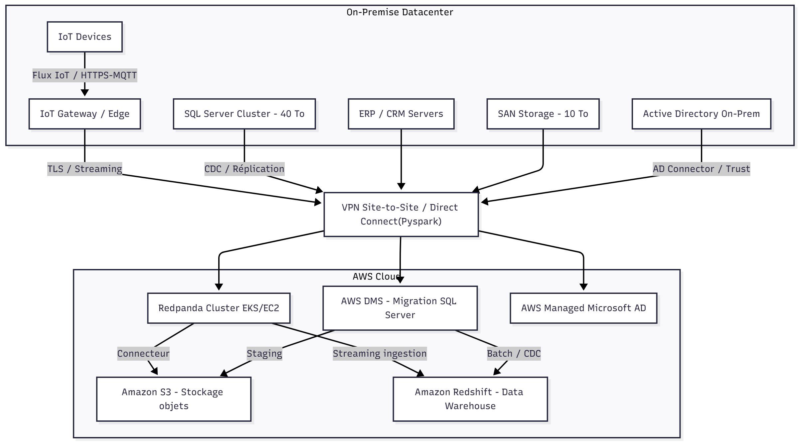
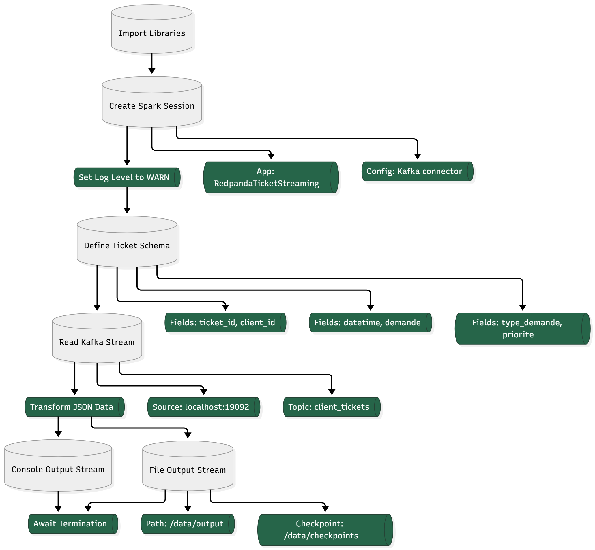

# Description

**Cette application illustre une pipeline ETL en temps réel utilisant :**

- Python + Confluent Kafka/Redpanda pour générer et publier des tickets clients aléatoires.

- Apache Spark Streaming pour consommer, parser et traiter ces tickets en continu.

- Sorties multiples : affichage en console et sauvegarde en fichiers JSON avec checkpoint.

Elle représente un exemple complet de streaming ETL pour monitoring, reporting ou analytics en temps réel.

## Schémas de l'Infrastructure 

- Python 3

- PySpark 4.0+

- Redpanda ou Kafka en local (port par défaut utilisé : 19092)

- Librairies Python : pip install confluent-kafka pyspark

- Dossiers pour la sortie JSON 

## **Installation des dépendances :**

`pip install -r requirements.txt`

(optionnel : créer un requirements.txt avec confluent-kafka et pyspark)

## Exécution

1. Lancer Redpanda / Kafka

Si vous utilisez Redpanda en local :

`rpk start`

2. Lancer le producteur de tickets

`python produer_tickets.py`

- Envoie un ticket JSON toutes les secondes dans le topic client_tickets.

3. Lancer Spark Streaming

`spark-submit spark_streaming_processor.py`

- Affiche les tickets en console.

- Sauvegarde également les tickets dans /data/output.

## Structure du projet

├── produer_tickets.py         # Producteur Kafka / Redpanda
├── spark_streaming_processor.py  # Traitement Spark Streaming
├── requirements.txt           # Dépendances Python
├── README.md                  # Documentation
├── /data/output               # Fichiers JSON générés
└── /data/checkpoints          # Checkpoints Spark

# **Flux de données (Pipeline ETL)**

- **Extraction :** Produits par produer_tickets.py, envoyés au topic client_tickets.

- **Transformation :** Spark Streaming lit les messages, parse le JSON et transforme en DataFrame.

- **Chargement :** Les données sont envoyées vers :

- **La console** pour visualisation en temps réel.

- **Des fichiers JSON** sur disque avec checkpointing pour tolérance aux pannes.

## Auteur

👤 Khalid OURO-ADOYI

(**Data Analyst & Data Engineer**) 

Email : khalidouroadoyi@gmail.com

LinkedIn :https://www.linkedin.com/in/khalid-ouro-adoyi/

GitHub :https://github.com/LIDONI